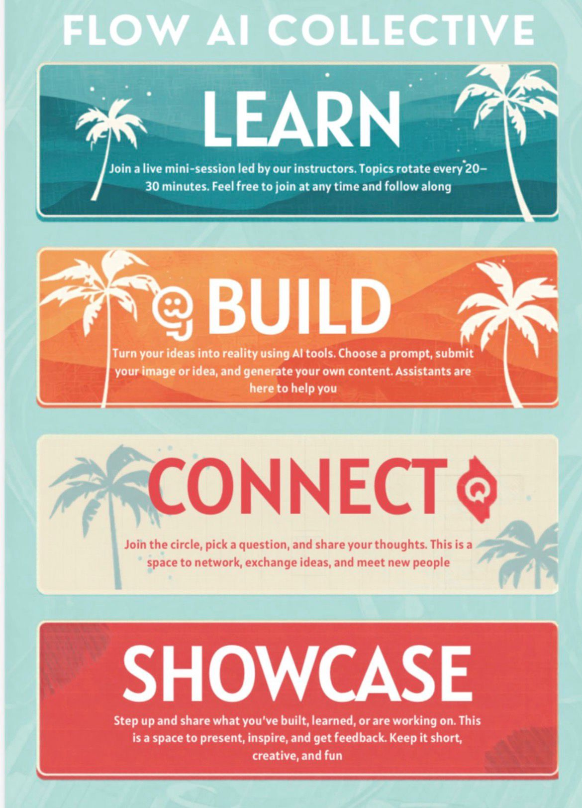

# flow.ai.collective

Welcome to a corner of the internet where **people and AI actually ship things together**. This repo is home to the **flow.ai collective**: a place to **learn** how workflows fit together, **build** with agents you can trust, **connect** with patterns others use in the real world, and **showcase** what “AI in production” can look like—without the hype deck.

---

## What’s in this repo? 📂

| Path | What it’s for |
|------|----------------|
| `assets/` | Images and media the collective uses in docs and examples |
| `examples/` | Ready-to-run **agent workflows** for Cursor and Claude (presentations, web apps, and more) |
| `build/` | **Your local scratch pad**—experiments, zips, temp clones. Nothing here belongs in git (see [AGENTS.md](AGENTS.md)) |
| `learn/` | Reserved for future learning paths and guides |

---

## Examples at a glance ✨

- **[Presentations](examples/presentations/README.md)** — HTML/CSS → Playwright → animated PowerPoint (`.pptx`) with the **ppt-creator** skill  
- **Web** — Next.js site templates, each with its own agent brief:
  - [Marketing site](examples/web/marketing-site/)
  - [SaaS site](examples/web/saas-site/)
  - [Ticketing site](examples/web/ticketing-site/)
  - [Photography site](examples/web/photography-site/)

Shared web guidance lives under `examples/web/.cursor/skills/web-developer/`.

---

## Prerequisites (repo-level) 🧰

You don’t need a single giant toolchain for the whole repo—**each example brings its own** (Python + Playwright for decks, Node for web, etc.).

**Everyone should have:**

- **Git** — clone and branch like a civilized mammal  
- **An editor you like** — we optimize for **Cursor** and **Claude** (desktop / Claude Code) as the “pair programmer”  
- **Curiosity** — optional but recommended

Open the **README** inside the example you care about for exact versions (Python 3.10+, Node LTS, and so on).

---

## Quick start 🚀

1. **Clone** this repository.  
2. **Pick an example** under `examples/` and open **that folder** as your workspace in Cursor (or `cd` there in the terminal) so `.cursor` paths and skills resolve correctly.  
3. Read the example’s **README** for install steps.  
4. If you’re driving with an AI agent, read **[AGENTS.md](AGENTS.md)** at the repo root, then the example’s own **`AGENTS.md`**.

---

## Contributing 🤝

We love PRs that teach something or remove friction. Read **[CONTRIBUTING.md](CONTRIBUTING.md)** for conventional commits, how to keep examples self-contained, and how we support both **Cursor** and **Claude**.

---

*Built with humans, agents, and too much coffee.*
