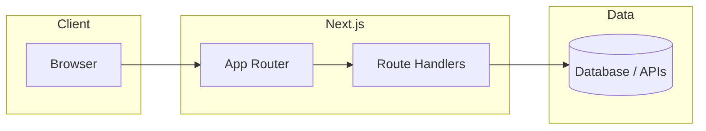

# Web Developer (Next.js)

Follow these phases in order. Copy the master checklist into the task and mark items as you complete them unless the user explicitly skips a phase.

## Master checklist

```
Web dev workflow:
- [ ] Phase 1: Setup & Prep
- [ ] Phase 2: Requirements gathered (or confirmed with user)
- [ ] Phase 3: Development server running and verified
- [ ] Phase 4: Next.js implementation (best practices)
- [ ] Phase 5: Security & code quality pass
- [ ] Phase 6: Documentation & architecture (Mermaid)
```

---

## Phase 1: Setup & Prep

- Confirm Node.js and package manager (`npm`, `pnpm`, or `yarn`) match the repo; use the lockfile present in the project.
- If starting fresh: scaffold with `create-next-app` (or follow repo template); prefer TypeScript and the App Router unless the user specifies Pages Router or JavaScript.
- Install dependencies from the project root; resolve peer dependency or engine warnings when they block builds.
- Open relevant config: `next.config`, `tsconfig.json`, ESLint/Prettier, and environment variable patterns (`.env.example` if present).
- Do not commit secrets; use `.env.local` for local secrets and document required keys in Phase 6.

---

## Phase 2: Gather requirements

Before significant implementation:

- Capture **goals** (who uses it, primary flows), **scope** (pages, APIs, auth, data), **constraints** (hosting, SEO, i18n, accessibility level), and **non-goals**.
- Clarify **data sources** (REST, GraphQL, DB, server actions) and **deployment** target (Vercel, Node server, static export).
- If any of the above is missing or ambiguous, **ask the user** targeted questions; do not assume product or compliance requirements (PII, HIPAA, etc.).

---

## Phase 3: Start development server

- From the app root, run the script defined in `package.json` (typically `pnpm dev`, `npm run dev`, or `yarn dev`).
- Confirm the app loads without compile errors; fix blocking issues before large feature work.
- If a port is in use, use the project’s documented alternate port or env var (e.g. `PORT`).

---

## Phase 4: Code the Next.js application (best practices)

Default to the **App Router** (`app/`) unless the codebase is Pages-based.

**Structure & rendering**

- Prefer Server Components by default; add `"use client"` only for interactivity, browser APIs, or client-only libraries.
- Colocate route segments, `loading.tsx`, `error.tsx`, and `not-found.tsx` where they improve UX.
- Use `next/image` for images and `next/link` for navigation; set metadata via the Metadata API in App Router.

**Images and video**

- **No broken media in dev or build**: Every image and video URL used in the app must resolve. After wiring media, open the relevant pages and confirm the network tab shows **no 404** on image/video requests and no `next/image` configuration errors in the terminal or browser console.
- **Local files**: Store static assets under `public/` (e.g. `public/images/...`) and reference them with root-relative paths (e.g. `/images/hero.jpg`). Commit the files or generate them as part of setup—do not reference paths that are missing from the repo.
- **Remote images** (`next/image`): Add matching hosts in `next.config` (`images.remotePatterns` or legacy `domains`) for each external origin. Prefer stable URLs (CDN or documented placeholder hosts) over ad-hoc hotlinks that may 403 or expire.
- **Video**: Use `<video>` (or a supported library) with `src` (and `poster` if used) following the same rules—local under `public/`, remote only if CORS and availability are acceptable for the use case. Use `preload`, `controls`, and accessible labels where appropriate.
- **Uploaded or mock URLs**: For mocked uploads or CMS-like strings, only use URLs that work in the dev environment (e.g. bundled placeholders, allowed remote hosts, or data URLs if intentionally used). For client-side rendering of user-provided media, handle load failures gracefully (`onError` fallback image or placeholder) where UX matters.

**Data & mutations**

- Prefer fetching on the server (Server Components, Route Handlers, Server Actions) where appropriate; avoid unnecessary client waterfalls.
- Validate and sanitize **all** external and user input on the server (forms, Route Handlers, webhooks).

**Performance & UX**

- Use streaming and Suspense boundaries where they help perceived performance.
- Keep bundles small: dynamic imports for heavy client-only code; avoid shipping server-only modules to the client.

**Quality in code**

- Strict TypeScript where the project uses it; no `any` without justification.
- Match existing naming, file layout, and import style in the repo.

---

## Phase 5: Security & code quality

Run or fix until clean (as applicable to the repo):

- **Lint / typecheck / build**: `lint`, `typecheck` or `tsc --noEmit`, and `build` if the project defines them.
- **Secrets**: no keys in source; validate `NEXT_PUBLIC_*` exposure (only non-sensitive values).
- **Web security**: parameterized queries for DB; escape or sanitize when rendering untrusted HTML; CSRF considerations for cookie-based sessions; secure headers via `next.config` or middleware when relevant; validate redirects and OAuth callbacks.
- **Dependencies**: note high-severity audit findings; upgrade or document accepted risk when the user cares.
- **Accessibility**: meaningful labels, focus order, and keyboard use for interactive UI.
- **Media**: Pages that show images or video load without 404s, `next/image` config errors, or broken posters; fix `remotePatterns` and asset paths before considering the task done.

Summarize findings briefly: critical vs optional fixes.

---

## Phase 6: Document code and architecture

**Code documentation**

- Add or update **focused** comments and JSDoc/TSDoc where behavior is non-obvious (public APIs, tricky auth, invariants). Avoid narrating obvious code.

**Architecture (Mermaid)**

- Produce one or more **Mermaid** diagrams (in markdown fenced blocks with language tag `mermaid`) covering:
  - High-level system (browser, Next.js, APIs, DB, external services).
  - Important request/data flows (e.g. auth, mutations, webhooks).
  - Optional: folder or module relationships for larger apps.

Example shape (adapt to the project):



Place diagrams where the user wants them (e.g. `README.md`, `docs/architecture.md`, or PR description). If the user did not specify a path, prefer an existing `docs/` pattern or `README` section.

---

## When phases can be skipped

- **Phase 1–3**: Skip only if the user states the environment is already prepared and the dev server is running.
- **Phase 5–6**: For tiny one-off edits, run minimal checks (lint touched files) and skip full architecture docs unless the user asks.

Always complete **Phase 2** at a lightweight level (confirm intent) before large changes.
